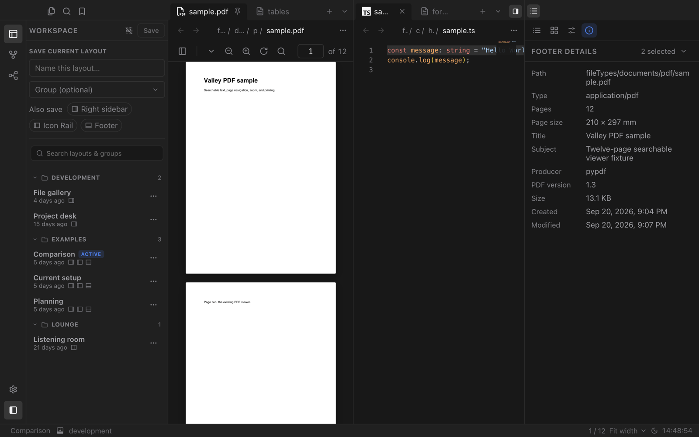
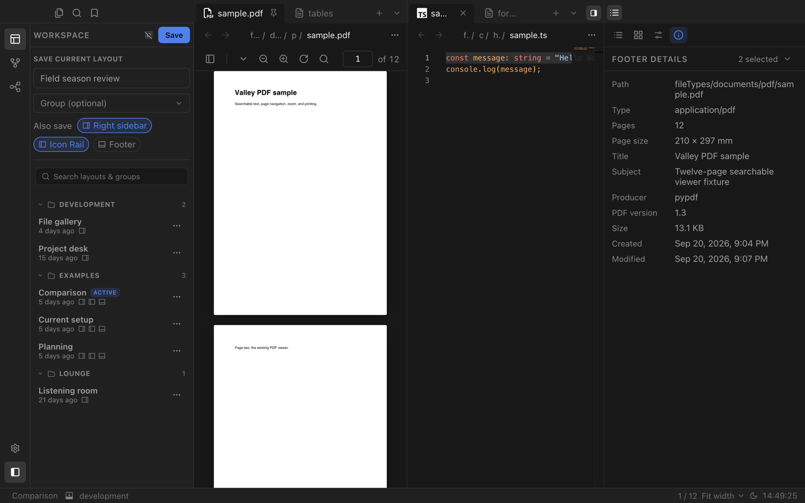

# Workspace

Save the way you work and come back to it in one click. Workspace stores named layouts with their panes, tabs and sidebars, so switching from writing to research to review takes a second.

## Layouts for every task

Arrange your panes and tabs the way a task needs them, then save the arrangement under a name. Loading it later restores the split panes, open tabs and sidebar widths exactly as they were.

- Organise layouts into groups, such as *Development* or *Examples*.
- The active layout is marked and shown in the footer.
- Search layouts and groups from the sidebar.

## Save exactly what you want

When you save, choose whether the layout should also remember the **right sidebar**, the **Icon Rail** or the **Footer**. Each part is saved only when you select it, so a layout can change just your panes or your whole window.

Your default Icon Rail, Footer and right sidebar settings are never overwritten by loading a layout.
